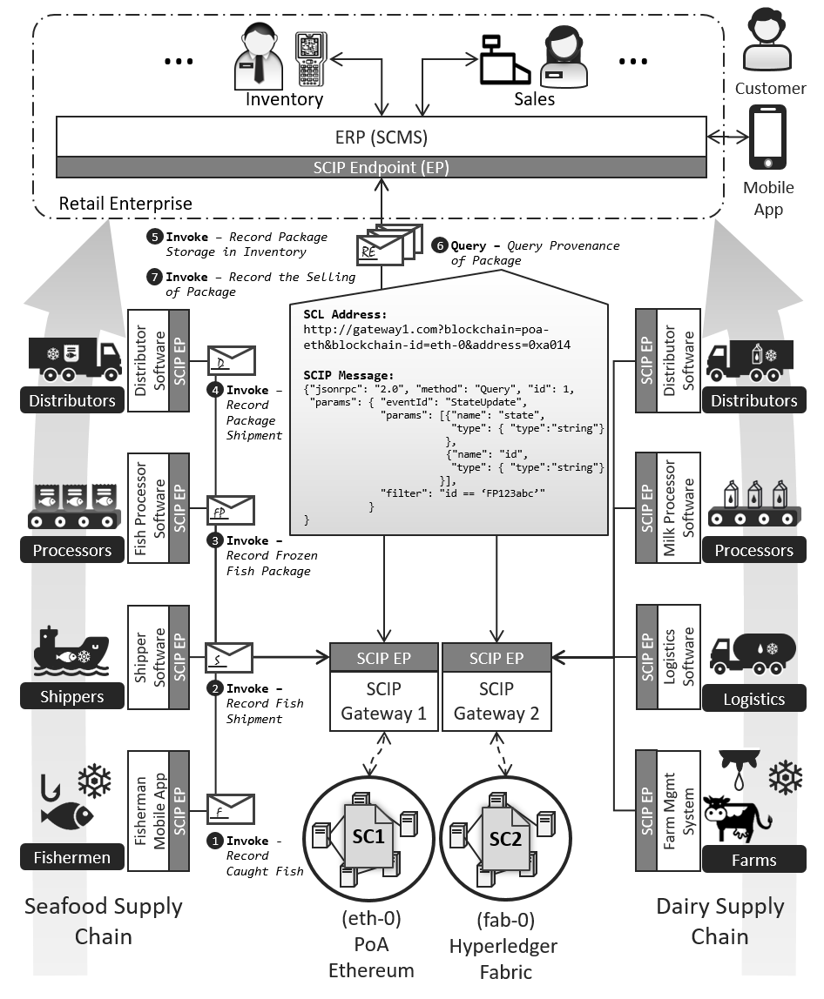

# Unified Smart Contracts Integration through a Service-Oriented Communication Infrastructure - Case Study

This case study focuses on the same scenario adopted in [SCIP-CaseStudy-2](https://github.com/ghareeb-falazi/SCIP-CaseStudy-2) development. 

## Introduction

A case study that shows how heterogeneous multi-blockchain smart contracts interaction could be integrated in client application using the toolscip development toolkit, which relies on the joint use of [Smart Contract Locator (SCL)](https://github.com/ghareeb-falazi/scl), [Smart Contract Description Language (SCDL)](https://github.com/floriandanielit/scdl), and [Smart Contract Invocation Protocol (SCIP)](https://github.com/lampajr/scip).

The following picture highlights the overall scenario that is involved in this case study:



The system focuses on a retailer enterprise that is connected to two supply chains (one for seafood products and one for dairy products). The two supply chains are managed by two different blockchain platforms, one permissionless ([Ethereum](https://ethereum.org/)) and one permissioned ([Hyperledger Fabric](https://www.hyperledger.org/projects/fabric)). The collaboration logic of the two supply chains is implemented by two smart contracts, one for the Ethereum blockchain ([Seafood contract](https://github.com/lampajr/case-study/tree/master/smartcontracts/ethereum/Seafood)) and on for the Fabric one ([Dairy chaincode](https://github.com/lampajr/case-study/tree/master/smartcontracts/fabric/dairy/javascript)). The access to the blockchains is provided by two [SCIP Gateways](https://github.com/ghareeb-falazi/BlockchainAccessLayer) (in this case one for each blockchain) via SCIP messages addressed at appropriate SCL addresses. All these information, e.g., the SCL, functions to invoke, events to monitor and etc. are provided in the SCDL descriptors published on the [SCDL Registry](https://scdlregistry.herokuapp.com/).  We will create the various components of this system, bring them up and then run a simple client application simulation using a command line tool ([CLISC](https://github.com/lampajr/toolscip/tree/master/packages/clisc)) that automates the communication with the SCDL Registry and the SCIP Gateways, abstracting away the user from the SCIP messages generation and managing. Moreover the CLISC tool shows the usage of the [Toolscip](https://github.com/lampajr/toolscip/), a smart contracts integration development toolkit. The sample client application allows the various roles presented in the figure to update the corresponding blockchains with supply-chain-related actions, e.g., by invoking the correct smart contracts functions.


## Prerequisites

- GNU/Linux OS (The scenario was implemented using Ubuntu 19.10 64-bit).
- [Docker](https://www.docker.com/) with [Docker-Compose](https://docs.docker.com/compose/).
- [Git](https://git-scm.com/) installed (use ```sudo apt-get install git``` on Debian/Ubuntu machines).
- The ports 3001, 7050, 7051, 7054, 8081, 8082 must be available at the host machine.
- [CLISC tool](https://github.com/lampajr/toolscip/wiki/CLISC-Tool) usage and commands.


## Setup

The following instructions assume you are using a Linux distribution.

- Clone this GitHub repository and navigate inside the cloned directory

  ```bash
  $ git clone https://github.com/lampajr/case-study.git
  $ cd case-study
  ```

- Using the terminal, navigate in the ```setup``` directory, and run the shell script ```start.sh```

  ```bash
  $ cd setup
  $ ./start.sh
  ```

  This will pull/create the necessary docker images, executing the docker-compose file to bring up the various docker containers needed, and deploy the Ethereum and Fabric smart contracts. Furthermore it downloads the SCDL descriptors of the two deployed [smart contracts](https://github.com/lampajr/case-study/tree/master/smartcontracts) from the [SCDL Registry](https://scdlregistry.herokuapp.com/).

- When the script is fully executed, you can proceed to the [Demo](#demo) section below.

- At the end, you can bring down the network executing the following command inside the ```setup``` directory

  ```bash
  $ ./stop.sh
  ```

  You can also remove BAL and ganache-cli images by combining the previous command with the ```rmi``` option as follows:

  ```bash
  $ ./stop.sh rmi
  ```


__NB:__ Quite all shall scripts require root privileges.


## Demo

- After the ```start.sh``` is successfully executed, execute the ```open-cli.sh``` shall script, as follows:

  ```bash
  $ ./open-cli.sh
  
   ____    _____      _      ____    _____ 
  / ___|  |_   _|    / \    |  _ \  |_   _|
  \___ \    | |     / _ \   | |_) |   | |  
   ___) |   | |    / ___ \  |  _ <    | |  
  |____/    |_|   /_/   \_\ |_| \_\   |_|  
  
  Open clisc-based client application,
  
  root@8b1f7a70a6de:/usr/src/cli-app#
  ```

  This script opens the docker container where the clisc-based client application is hosted.

- Use the terminal where you executed the ```open-cli.sh``` script to interact with the two smart contracts deployed on the blockchain platforms. The interaction must be performed using the [CLISC tool](https://github.com/lampajr/toolscip/wiki/CLISC-Tool), i.e., using its commands like ```invoke```, ```query``` and so on.  

  ```bash
  $ clisc invoke Seafood -I id1 --corrId myId --method registerFish -v fish1 -v Oslo -v A.Fisher
  $ clisc query Seafood -I id1 --event fishRegistered
  ```

  Behind the scenes, [SCIP Invocation messages](https://github.com/lampajr/scip#invocation) are sent to a [SCIP Gateway](https://github.com/ghareeb-falazi/BlockchainAccessLayer) that translates them into blockchain-specific transactions, hence in either Ethereum or Fabric transactions.

- Use another terminal, and execute the ```open-server.sh``` shall script to monitor the receipt of asynchronous responses.

  ```bash
  $ ./open-server.sh
  
   ____    _____      _      ____    _____ 
  / ___|  |_   _|    / \    |  _ \  |_   _|
  \___ \    | |     / _ \   | |_) |   | |  
   ___) |   | |    / ___ \  |  _ <    | |  
  |____/    |_|   /_/   \_\ |_| \_\   |_|  
  
  Open the server application, that is in
  charge to monitor SCIP async responses
  
  Client server listening on port: 3001
  ```